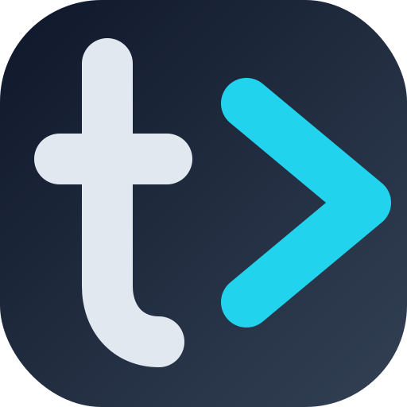

# `t>` Tabminal

> **The AI-Native Terminal for the Mobile Age.**
> Seamlessly code from your Desktop, iPad, or iPhone with an intelligent, persistent, and touch-optimized experience.



## 🌟 Why Tabminal?

Tabminal bridges the gap between traditional CLI tools and modern AI capabilities, all while solving the UX challenges of coding on mobile devices.

## ✨ Innovative Designs

- `Server-side session persistence` ensures your sessions with the AI agent are maintained, allowing you to pick up where you left off at any time.
- `Fast and stable connection management` delivers a seamless, agile experience across platforms and devices, with native support for network roaming.
- Enjoy a comprehensive `Progressive Web App (PWA) experience` anytime, anywhere; all you need is a modern browser to start working.
- `Proactive AI integration` means your terminal becomes your work context. You can ask questions about your current session at any time, and the AI will automatically retrieve the context to accurately solve problems, even proactively offering assistance when commands fail.
- `Cloud-native design` enables access via Zero Trust or VPN, providing unprecedented convenience for managing cloud servers. 


<details>

<summary>📷 More screenshots</summary>


</details>

### 🧠 AI-Native Intelligence
Powered by **modern AI models** (via OpenRouter), Tabminal understands your context.
*(Defaults to **Gemini 2.5 Flash** for optimal speed/performance balance if not configured)*
*   **Context-Aware Chat**: Type `# how do I...` to ask questions. The AI knows your **CWD**, **Environment**, and **Recent History**.
*   **Auto-Fix**: Command failed? Tabminal automatically analyzes the exit code and error output to suggest fixes. No copy-pasting required.
*   **Web Search**: Enable Google Search integration to let the AI fetch real-time answers from the web.

### 📱 Ultimate Mobile Experience
Built from the ground up for **iPadOS** and **iOS**.
*   **HHKB Virtual Keyboard**: A specialized software keyboard overlay with `CTRL`, `ALT`, `TAB`, and arrow keys.
    *   **Smart Modifiers**: Toggle `SHIFT` for continuous entry.
*   **Responsive Layout**: Auto-adapts to landscape/portrait modes, respecting Safe Areas and Notches.
*   **PWA Ready**: Install to Home Screen for a full-screen, native app feel.

### 💻 Powerful Desktop Features
*   **Persistent Sessions**: Your terminal state lives on the server. Refresh or switch devices without losing your work.
*   **Built-in Editor**: Integrated **Monaco Editor** (VS Code core) allows you to edit files directly on the server.
*   **Visual File Manager**: Sidebar file tree for easy navigation.
*   **Network Heartbeat**: Real-time latency visualization.

## 🚀 Getting Started

### Prerequisites
*   Node.js >= 22
*   (Optional) An [OpenRouter](https://openrouter.ai/) API Key if you want AI features.
*   (Optional) A pair of Google API Key and Search Engine ID (CX) for web search capabilities.

### ⚠️ Security Warning
Tabminal provides **full read/write access** to the underlying file system.
*   **Do NOT expose this to the public internet** without proper protection (VPN, etc).
*   The `--accept-terms` flag is required to acknowledge that you understand these risks.

### Quick Start (No Install)
Run directly with `npx`:

```bash
npx tabminal --openrouter-key "YOUR_API_KEY" --accept-terms
```

### Installation

```bash
# Clone the repository
git clone https://github.com/leask/tabminal.git
cd tabminal

# Install dependencies
npm install

# Start the server
npm start -- --openrouter-key "YOUR_API_KEY" --accept-terms
```

### Configuration

You can configure Tabminal via command-line arguments, environment variables, or a `config.json` file.

| Argument | Env Variable | Description | Default |
| :--- | :--- | :--- | :--- |
| `-p`, `--port` | `PORT` | Server port | `9846` |
| `-h`, `--host` | `HOST` | Bind address | `127.0.0.1` |
| `-a`, `--password` | `TABMINAL_PASSWORD` | Access password | (Randomly Generated) |
| `-k`, `--openrouter-key` | `TABMINAL_OPENROUTER_KEY` | AI Provider API Key | `null` |
| `-m`, `--model` | `TABMINAL_MODEL` | AI Model ID | `gemini-2.5-flash-preview-09-2025` |
| `-g`, `--google-key` | `TABMINAL_GOOGLE_KEY` | Google Search API Key | `null` |
| `-c`, `--google-cx` | `TABMINAL_GOOGLE_CX` | Google Search Engine ID (CX) | `null` |
| `-d`, `--debug` | `TABMINAL_DEBUG` | Enable debug logs | `false` |
| `-y`, `--accept-terms` | `TABMINAL_ACCEPT` | **Required**: Accept security risks (Full FS Access) | `false` |

## ⌨️ Shortcuts & Gestures

*   **`Ctrl + Shift + T`**: New Terminal
*   **`Ctrl + Shift + W`**: Close Terminal
*   **`Ctrl + Shift + E`**: Toggle Editor Pane
*   **`Ctrl + Up` / `Down`**: Focus Editor / Terminal
*   **`Ctrl + Shift + [` / `]`**: Switch Terminal
*   **`Ctrl + Alt + [` / `]`**: Switch Open File in Editor
*   **`Ctrl + Shift + ?`**: Show Shortcuts Help
*   **`Ctrl` / `Cmd` + `F`**: Find in Terminal

### Touch Actions
*   **Virtual `SYM`**: Toggle HHKB keyboard overlay.

## 🛠 Tech Stack
*   **Backend**: [Node.js](https://nodejs.org), [Koa](https://github.com/koajs/koa), [node-pty](https://github.com/microsoft/node-pty), [WebSocket](https://github.com/websockets/ws).
*   **Frontend**: [Vanilla JS](http://vanilla-js.com/) 😝, [xterm.js](https://github.com/xtermjs/xterm.js), [Monaco Editor](https://github.com/microsoft/monaco-editor).
*   **AI**: Integration via [utilitas](https://github.com/leask/utilitas).

## 📄 License
[MIT](LICENSE)
